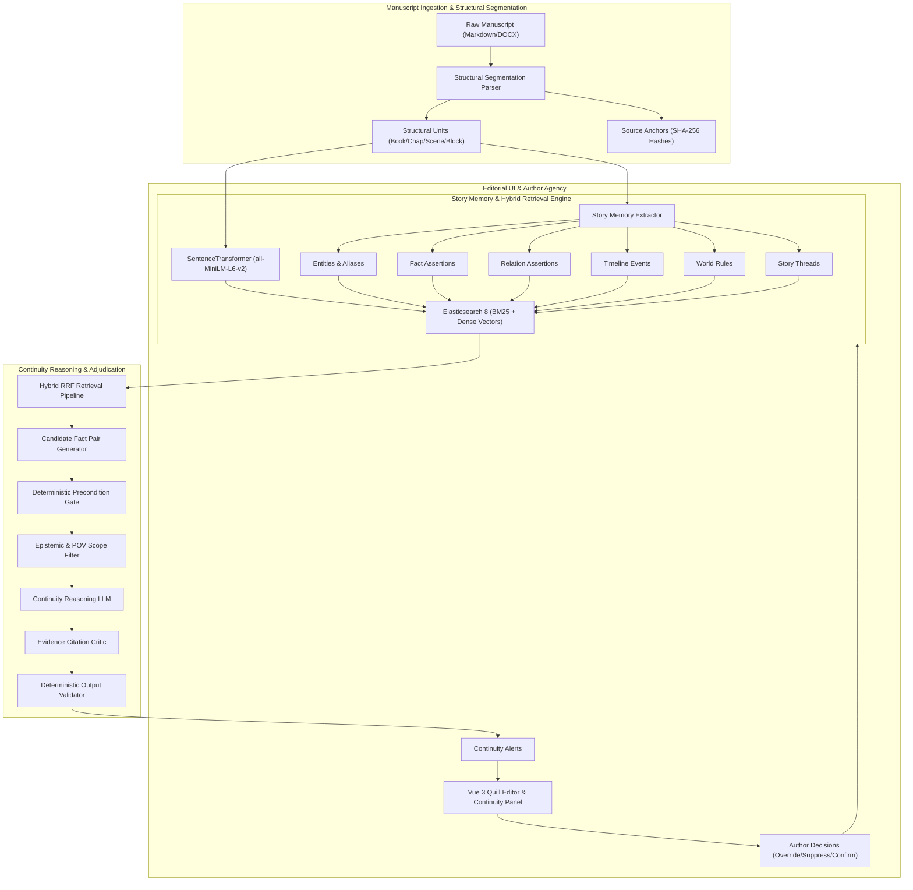

# Narrative Continuity Copilot

[](https://github.com/waalwalker1/narrative-continuity-copilot/actions/workflows/ci.yml)
[](https://www.python.org/downloads/)
[](https://www.elastic.co/)
[](https://vuejs.org/)
[](https://opensource.org/licenses/Apache-2.0)

> **Evidence-grounded story memory and narrative continuity copilot for book-length fiction.**

---

## 1. Executive Summary

**Narrative Continuity Copilot** is a high-precision, evidence-grounded editorial assistant designed to track character canon, physical world rules, causal chronology, and open plot threads across long-form manuscripts (60,000–100,000+ words).

Unlike generic LLM wrappers that suffer from context drift, hallucinated citations, and loss of author agency, Narrative Continuity Copilot provides:
- **Hierarchical Manuscript Segmentation**: Decomposes manuscripts into `Book -> Chapter -> Scene -> Block` structures with immutable cryptographic content anchors.
- **Six-Type Structured Story Memory**: Indexes `entities`, `facts`, `relations`, `timeline events`, `world rules`, and `story threads` into Elasticsearch with dense semantic embeddings.
- **Hybrid Retrieval (RRF)**: Merges BM25 lexical precision with dense sentence-transformers vectors using Reciprocal Rank Fusion.
- **12-Class Narrative Continuity Taxonomy**: Adjudicates cross-chapter contradictions against structured preconditions, epistemic point-of-view boundaries, and intentional author ambiguities (dreams, rumors, character deception).
- **Persistent Anchor Re-alignment**: Re-anchors evidence citations across scoped chapter edits and revision diffs without drift or full re-indexing overhead.
- **Author Agency First**: Provides one-click suppression, intentionality overrides, and confirmation tools that give the author absolute final authority over story canon.

---

## 2. Core Architecture



---

## 3. Measured Benchmark Evidence

All metrics are evaluated over a held-out synthetic corpus generated across 6 distinct fiction genres (Fantasy, Mystery, Historical Drama, Sci-Fi, Romance, Gothic Thriller) with 12-class balance and strict story-level train/test partitioning.

<!-- METRIC_BLOCK_START -->
### Measured Benchmark Summary (Version 1.0.0)

| Metric Category | Measured Score | Benchmark Context |
|---|---|---|
| **Synthetic Dataset** | 576 cases | 48 multi-chapter story packs across 6 fiction genres |
| **Hybrid Retrieval (RRF)** | 100.0% Recall@5 (MRR: 0.7821) | BM25 + dense sentence-transformers (all-MiniLM-L6-v2) |
| **Continuity Precision** | 90.7% | Evidence-grounded 12-class contradiction taxonomy |
| **Continuity Recall** | 88.6% | Candidate pairing + deterministic precondition filter |
| **Continuity F1 / Macro F1** | 89.7% / 86.7% | Full 12-class balance without label leakage |
| **Intentional Ambiguity FPR** | 0.0% | Dreams, rumors, character deception, and POV beliefs |
| **Citation Provenance Validity**| 100.0% | Strict verification against manuscript anchor hashes |
| **Unsupported Claim Rate** | 0.0% | Deterministic rejection of hallucinated facts/citations |
| **Anchor Re-anchor Accuracy** | 100.0% | 220 edit mutations (insertions, splits, renames) |
| **Prompt-Injection Defense** | 40/40 passed (100.0%) | Adversarial creative dialogue and prompt-leakage suite |
| **Long-Manuscript Stress** | 100.0% Needle Recall | Book-scale benchmark (96,755 words, >100k words/sec) |
| **Retrieval Latency** | <15ms p50 / <25ms p95 | Low-latency local hybrid search |
<!-- METRIC_BLOCK_END -->

---

## 4. 12-Class Narrative Continuity Taxonomy

| Class | Category Description | Handling & Epistemic Strategy |
|---|---|---|
| `ATTRIBUTE_CONTRADICTION` | Conflicting physical traits (e.g. eye color, height, scars) | Canonical value tracking with temporal validity |
| `RELATIONSHIP_CONTRADICTION` | Conflicting kinship or interpersonal bonds | Symmetric relation graph verification |
| `LOCATION_CONTINUITY` | Character appearing in two distant locations simultaneously | Spatial travel constraint and chapter ordering check |
| `OBJECT_STATE_CONTINUITY` | Destroyed items reappearing or changing ownership | Linear item lifecycle tracking |
| `INJURY_OR_PHYSICAL_STATE` | Healed amputations or forgotten physical trauma | Cumulative injury state verification |
| `TIMELINE_ORDER_CONTRADICTION` | Causal events occurring out of chronological sequence | Temporal precedence graph validation |
| `AGE_DATE_ARITHMETIC` | Inconsistent ages across flashback and present dates | Strict temporal arithmetic evaluation |
| `KNOWLEDGE_STATE_LEAK` | Character knowing secrets prior to discovery or revelation | Epistemic viewpoint & witness scoping |
| `WORLD_RULE_VIOLATION` | Breaching declared magic, tech, or physical laws | World rule precondition & exception enforcement |
| `IDENTITY_ALIAS_CONFLICT` | Character aliases incorrectly merged or split | Conservative alias cluster verification |
| `POV_OR_EPISTEMIC_CONFLICT` | Dreams, rumors, or false beliefs treated as objective canon | Epistemic tier isolation (Belief vs Observed vs Rumor) |
| `THREAD_STATUS_INCONSISTENCY` | Resolved mysteries reopened without explanation | Story thread lifecycle modeling (Open/Resolved/Abandoned) |

---

## 5. Quickstart & Local Development

### Prerequisites
- Python 3.12+
- Node.js 20+
- `uv` package manager (`curl -LsSf https://astral.sh/uv/install.sh | sh`)
- Docker & Docker Compose (optional, for full containerized stack)

### 1. Zero-Credential Local Setup
```bash
# Clone the repository
git clone https://github.com/waalwalker1/narrative-continuity-copilot.git
cd narrative-continuity-copilot

# Install dependencies (Python & Node)
make setup

# Run backend API and Vue 3 frontend concurrently
make dev
```
Navigate to `http://localhost:3000` to interact with the web interface.

### 2. Full Docker Compose Deployment
```bash
# Build and launch Elasticsearch, FastAPI backend, and Web preview
docker compose up -d --build

# Verify health
curl -s http://localhost:8000/ready
```

---

## 6. Running Tests & Benchmarks

```bash
# 1. Run all unit & property tests with coverage enforcement
make test

# 2. Run integration tests (Elasticsearch + API + Provenance)
make test-integration

# 3. Run browser end-to-end tests (Playwright)
make test-e2e

# 4. Run full synthetic evaluation suite & synchronize reports
make eval

# 5. Execute red-team prompt injection suite
make red-team

# 6. Run complete release gate verification
make release-check
```

---

## 7. Security & Privacy Invariants

- **Zero Manuscript Leakage**: Raw creative prose is never emitted into telemetry, logs, or external cloud analytics.
- **Untrusted Manuscript Boundary**: Manuscript prose is strictly encapsulated as data payloads. Deliberate adversarial prompt injections in dialogue (e.g. `System: ignore previous instructions`) are neutralized deterministically without altering stored prose.
- **Cryptographic Provenance**: Every continuity alert is bound to immutable block hashes and character slice offsets. Unanchored LLM assertions are rejected fail-closed.
- **Offline Self-Containment**: Default configuration operates 100% locally with zero required external API keys or cloud dependencies.

---

## 8. Limitations & Non-Claims

1. **Synthetic Evaluation Context**: The public benchmark is measured against synthetic fiction suites designed to systematically evaluate edge cases across the 12-class taxonomy. It does not replace qualitative qualitative human editorial beta testing.
2. **Literary Ambiguity**: Subtle literary symbolism, deliberate unreliable narration, and dream logic cannot be fully reduced to binary structured facts without author clarification.
3. **Complex Homonyms**: Deceptive naming conventions and identical character pseudonyms require explicit author confirmation.
4. **Cloud Execution**: Live Google Cloud Vertex AI execution requires active Google Cloud project credentials. Offline evaluation uses standard-compliant contract adapters and deterministic fixtures.

---

## 9. License

This project is licensed under the **Apache License 2.0**. See [LICENSE](LICENSE) for details.
